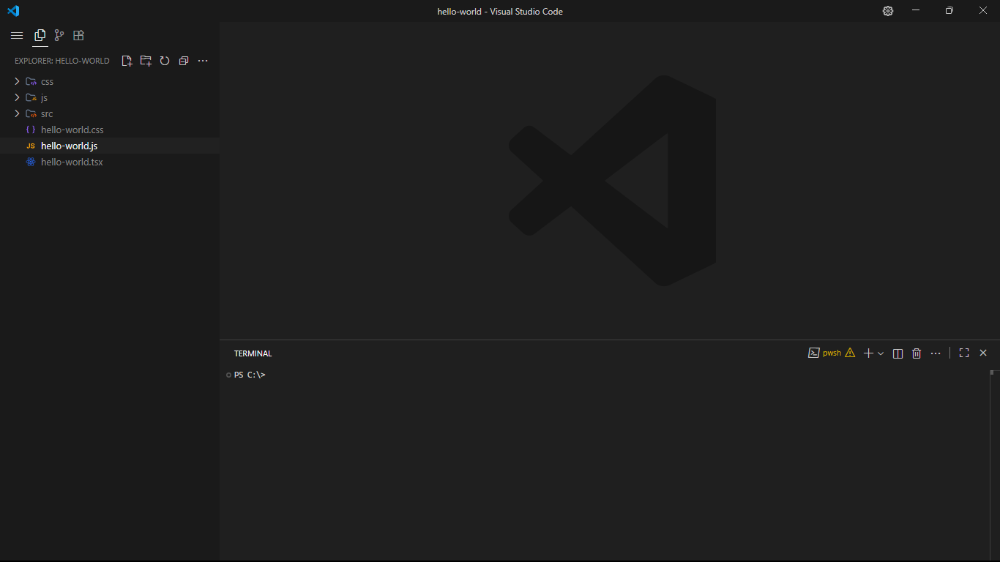

## Minimalist Vsc settings

This's my minimalist Visual Studio Code `settings.json`

### al Requires

**Extentions**

- Min Theme
- Prettier
- Symbols

**Font**
- JetBrains Mono

**Others**

- Better Comments

###  Example

<!--  -->
<!--  -->
<!--  -->
<!-- ) -->
